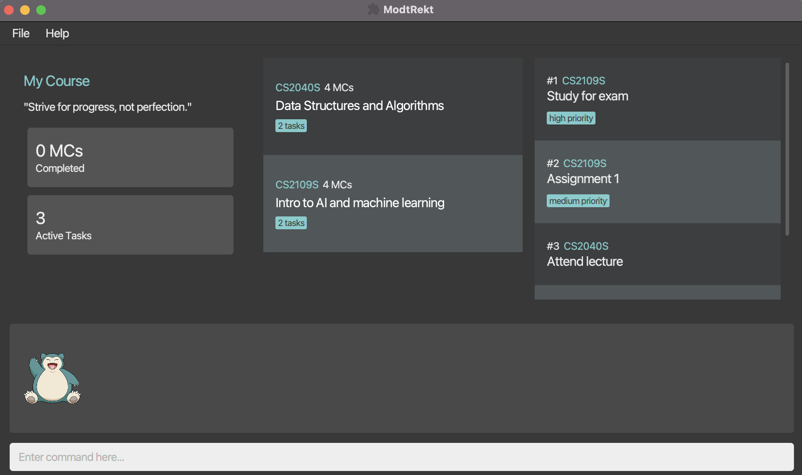

AddressBook Level 3 (AB3) is a **desktop app for managing contacts, optimized for use via a Command Line Interface** (CLI) while still having the benefits of a Graphical User Interface (GUI). If you can type fast, AB3 can get your contact management tasks done faster than traditional GUI apps.

* Table of Contents
{:toc}

--------------------------------------------------------------------------------------------------------------------

## Quick start

1. Ensure you have Java `11` or above installed in your Computer.

1. Download the latest `addressbook.jar` from [here](https://github.com/se-edu/addressbook-level3/releases).

1. Copy the file to the folder you want to use as the _home folder_ for your AddressBook.

1. Double-click the file to start the app. The GUI similar to the below should appear in a few seconds. Note how the app contains some sample data. 
   

1. Type the command in the command box and press Enter to execute it. e.g. typing **`help`** and pressing Enter will open the help window. 
   Some example commands you can try:

   * **`list`** : Lists all contacts.

   * **`add`**`n/John Doe p/98765432 e/johnd@example.com a/John street, block 123, #01-01` : Adds a contact named `John Doe` to the Address Book.

   * **`delete`**`3` : Deletes the 3rd contact shown in the current list.

   * **`clear`** : Deletes all contacts.

   * **`exit`** : Exits the app.

1. Refer to the [Features](#features) below for details of each command.

--------------------------------------------------------------------------------------------------------------------

## Features

### General
`help`

Shows a message which explains the basic commands and links to the user guide.

### Modules

### Adding a module: `add module`

Adds a module to the program.

Format: `add module <module code>`

Shorthand: `add -m <module code>`
- The module code is case insensitive e.g. `cs2103t` will match **CS2103T**

Examples:
- `add module CS2103T`
- `add -m CS2103T`

### Removing a module: `module remove`

Deletes a module from the program.

Format: `remove module <module code>`

Shorthand: `rm -m <module code>`
- The module code is case insensitive e.g. `cs2103t` will match **CS2103T**
- Module code must match an existing module.

Examples:
- `remove module CS2103T`
- `rm -m CS2103T`

### Entering a module: `cd`

Sets the current module page to the specified module.

Format: `cd <module code>`

Allows user to view information relating to the specified module.
- Scopes the user’s actions to the specified module.
- The module code is case insensitive e.g. `cs2103t` will match **CS2103T**
- Module code must match an existing module.

Examples:
- `cd CS2103T`

### Listing all modules: `list modules`

Lists all the modules added by the user.

Format: `list modules`

Shorthand: `ls -m`

Examples:
- `list modules`

--------------------------------------------------------------------------------------------------------------------

## FAQ

**Q**: How do I transfer my data to another Computer? 
**A**: Install the app in the other computer and overwrite the empty data file it creates with the file that contains the data of your previous AddressBook home folder.

--------------------------------------------------------------------------------------------------------------------

## Command summary

Action | Format, Examples
--------|------------------
**Add** | `add n/NAME p/PHONE_NUMBER e/EMAIL a/ADDRESS [t/TAG]…​`   e.g., `add n/James Ho p/22224444 e/jamesho@example.com a/123, Clementi Rd, 1234665 t/friend t/colleague`
**Clear** | `clear`
**Delete** | `delete INDEX`  e.g., `delete 3`
**Edit** | `edit INDEX [n/NAME] [p/PHONE_NUMBER] [e/EMAIL] [a/ADDRESS] [t/TAG]…​`  e.g.,`edit 2 n/James Lee e/jameslee@example.com`
**Find** | `find KEYWORD [MORE_KEYWORDS]`  e.g., `find James Jake`
**List** | `list`
**Help** | `help`
