## Table of Contents
- [Introduction](#introduction)
- [Quick Start](#quick-start)
- [About the user guide](#about-the-user-guide)
    - [Layout of window](#layout-of-window)
    - [General Command Syntax](#general-command-syntax)
    - [Command Quirks](#command-quirks)
- [Features](#features)
    - [Parameters and constraints](#parameters-and-constraints)
    - [General](#general)
        - [help command](#help-command-help)
        - [exit command](#exit-command-exit)
    - [Modules](#modules)
        - [add module command](#adding-a-module-add-module)
        - [remove module command](#removing-a-module-remove-module)
        - [cd module command](#entering-a-module-cd)
        - [exit module command](#exiting-a-module-cd)
        - [done module command](#marks-a-module-as-done-done-module)
        - [undone module command](#marks-undone-a-module-undone-module)
        - [list module command](#listing-all-modules-list-module)
        - [edit module command](#editing-modules-edit-module)
    - [Tasks](#tasks)
        - [add task command](#adding-a-task-add-task)
        - [remove task command](#removing-a-task-remove-task)
        - [done task command](#marking-a-task-as-done-done-task)
        - [undone task command](#marking-a-task-as-undone-undone-task)
        - [list task command](#listing-all-tasks-list-task)
        - [edit task command](#editing-tasks-edit-task)
- [FAQ](#faq)
- [Command Summary](#command-summary)
- [Glossary](#glossary)

## Introduction

ModtRekt is a desktop app created for NUS students to have a faster and more organised way to **manage their modules and
tasks**. It ensures that you would **never forget another task or miss another deadline**. This way you can focus on
learning and not be sidetracked by unexpected tasks that you forget. With ModtRekt, you can **quickly add tasks**, see your 
**upcoming deadlines**, and **filter your tasks by their module**.

Modtrekt is optimized for use via a command line interface (CLI) for **faster navigation** and input while retaining
the benefits of a graphical user interface (GUI).

This user guide contains in-depth information which can help new users learn all the features of ModtRekt. If you
are an experienced user, the a command summary at the bottom can get you up to speed.

## Quick Start

1. Ensure you have Java 11 or above installed on your computer.

2. Download the latest `modtrekt.jar` from [here](https://github.com/AY2223S1-CS2103T-W10-4/tp/releases).

3. Copy the file to the folder you want to use as the home folder for your module tracker.

4. Double-click the file to start the app. The GUI similar to the screenshot below should appear in a few seconds. Note
   how the app contains some sample data.

5. Type the command in the command box and press `Enter` to execute it. e.g. typing `help` and pressing `Enter` will open the help window.

6. Here are some example commands you can try:

    1. `add module CS2103T`: Adds a module called CS2103T to the module tracker.

    1. `cd CS2103T`: Sets the current module page to CS2103T.

    1. `add task "tP v1.3" -d 2022-10-28`: Adds a task called "tP v1.3", with a deadline of 28/10/2022, to the module tracker.

    1. `list task`: Lists all the active tasks.

7. `remove task 1`: Removes the first task of CS2103T.

8. `exit`: Exits the app.

9. Refer to the Features below for details of each command.

## About the user guide

### Layout of window

The image below shows what each window of the application represents.

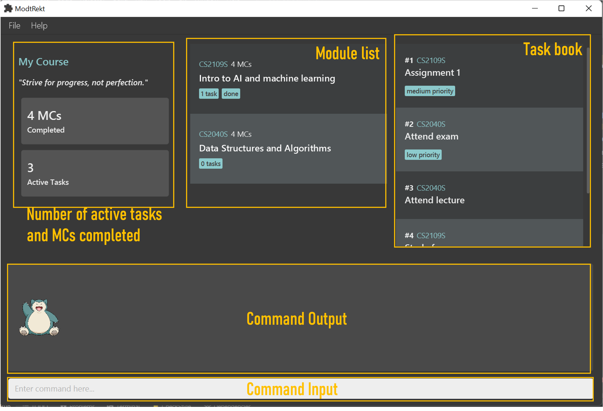

- The command output displays the command results (i.e. success or failure messages)
- The command input is where you type in your commands
- The Module List and Task Book automatically updates to show various modules and tasks depending on your commands.

### General Command Syntax

**TLDR:** If you're familar with Unix-style commands, e.g. Git, the ModtRekt commands have a similar syntax.
A command has up to 2 words, and each parameter prefixed with a dash (`-`) and may have a single value after a space.
Values with spaces must be enclosed in quotes (`"`).

---

Every command starts with a **command phrase**, which may be single or multiple words.

> For example, `help` is a single-word command phrase.
> `add module` and `add task` are examples of multiple-word command phrases, but `add` itself is not a valid command.

The command phrase may be followed (after a space) by a **main parameter**, depending on the command.
Fret not about the specifics of the commands in this section; we will cover each command in detail in the following sections.

> For example, `CS2040S` is the main parameter in the commands `add module CS2040S` and `cd CS2040S`.

Most commands have **parameters** which are prefixed with a dash (`-`). Each parameter can have _at most_ a **_single_ value**
immediately after it (and the mandatory space).

> Let's break down the command `add task "tP v1.3" -d 2022-10-28`.
> We know from above that `add task` is the command phrase, and `tP v1.3` is the main parameter.
> Here, `-d` is a parameter, and `2022-10-28` is its value.

Some commands even have **multiple parameters**, each separated by a space.

> For example, `add task -d 2022-10-28 "tP v1.3" -p high` has two parameters: `-d` and `-p`.

In the example above, notice how the position of the main parameter does not matter.
This is possible because every parameter has at most one value, so the command is still valid (and correct)!

**Also, notice how we have been enclosing some parameter values in quotes (`"` or `'`)—this is only necessary if your value
contains a space.**

Some parameters are optional. By default all parameters in the command formats we specify are mandatory.
We will surround **optional parameters** with square brackets (`[]`).

> For example, we define the list command format to be `list task [-a]`. This means you need not specify the `-a` parameter depending on your intention with the usage of the command.

That's it! You should now be able to understand the command syntax for the rest of this document.

### Command Quirks

You may be wondering how to include quotes in your parameter values. For example, what if you want to add a task with the name `CS2103T "iP" Week 6`?

You can do so by enclosing the entire value in quotes of the other type. For example, if you use double-quotes in your
value, you can enclose the entire value in single-quotes, and vice versa.

> For example, `add task 'CS2103T "iP" Week 6' -d 2022-10-28` includes the double-quotes in the task description.

Alternatively, you can escape the quotes (or any symbol) by using a backslash (`\`) before the quote,
which tells ModtRekt to treat the quote as a normal character.

> The command `add task "CS2103T \"iP\" Week 6" -d 2022-10-28` is equivalent to the previous example.

## Features

In this section, we will cover the features of ModtRekt, and introduce the command syntaxes.

> IMPORTANT: Every task has to be associated with a module. There may not be any standalone tasks without a created module.

### Parameters and constraints summary

For the following parameters, all inputs cannot be blank

| Parameters           | Constraints                                                                  | Remarks                                                          |
|----------------------|------------------------------------------------------------------------------|------------------------------------------------------------------|
| **Index**            | Positive integer less than list size greater than 0                  | Must be a valid index in module list/task book                   |
| **Module Code**      | Alphanumeric characters no white space 6 to 9 characters long        | Input is case in-sensitive. E.g. `cs2103t` will match `CS2103T`  |
| **Module Name**      | Alphanumeric characters spaces allowed less than 100 characters long |                                                                  |
| **Module Credits**   | Numeric characters up till 2 digits cannot be negative               |                                                                  |
| **Task description** | ASCII characters up till 100 characters                                  |                                                                  |
| **deadline**         | in format `YYYY-MM-DD` each input is integer from 0 to 9                 |                                                                  |
| **priority**         | either `LOW`, `MEDIUM`, `HIGH`, `NONE`                                       | Input is case in-sensitive. E.g. `LoW` will match `LOW`          |

### General

#### Help command: `help`

Shows a message which provides a link to this user guide.

Sample execution of command `help`:
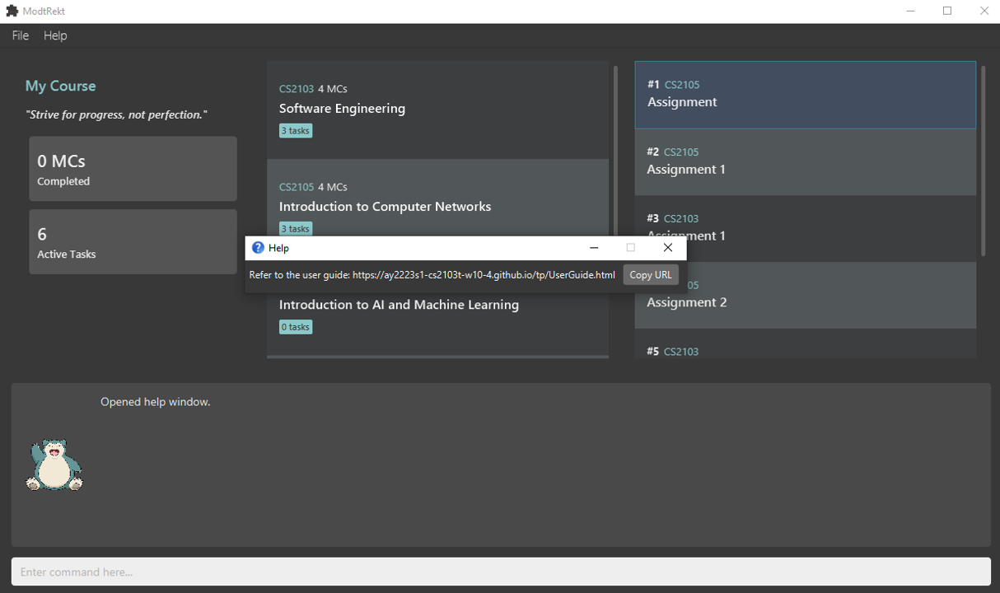

#### Exit command: `exit`

Exits the application.

### Modules

#### Adding a module: `add module`

Adds a module to the application.

To allow you to easily add modules via their module code, our module information is fetched from
[NUSMods](https://nusmods.com/modules?sem[0]=1&sem[1]=2&sem[2]=3&sem[3]=4),
hence the module code you specify must be a valid NUS module code.
If the module code is invalid, the module will not be added. Additionally, since an integration with NUSMods
is a collaboration we would like to seek in future revisions of our app, we have decided to use the AY2022-2023 module
list, hence beyond this AY, the module information and codes may have changed.

Format: `add module <module code>`

Shorthand: `add mod <module code>`

- The module name (if provided) must be enclosed in double-quotes (`""`) if it contains spaces.

Examples:
- `add module CS2103T`
- `add mod CS2103T`

Sample execution of command `add mod CS2100`:
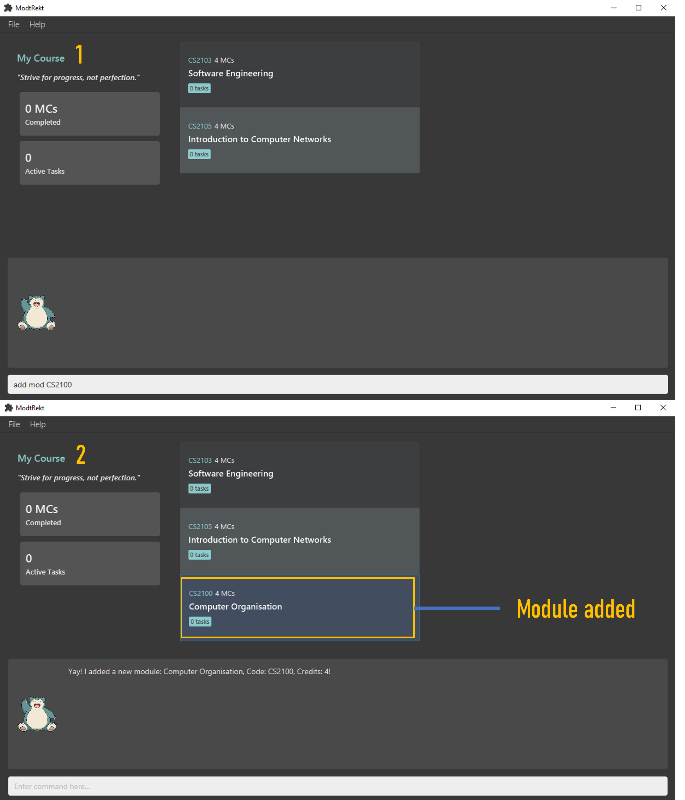

The app also supports the addition of customised modules, which may or may not be in NUSMods.
This is useful if you have other commitments, such as internships, that they would like to track in the app.
Note that if your customised module is not in NUSMods, you would still need to specify the module credits, for example, 0.

Format: `add module <module code> -n <custom module name> -cr <module credits>`

Shorthand: `add mod <module code> -n <custom module name> -cr <module credits>`

- Note that the credits still need to be supplied, even if it is 0.

Examples:
- `add module CCA -n "Basketball Club" -cr 0`
- `add mod CS10 -n "Non-credit Bearing Internship" -cr 0`

Sample execution of command `add mod CCA -n Volleyball -cr 0`:
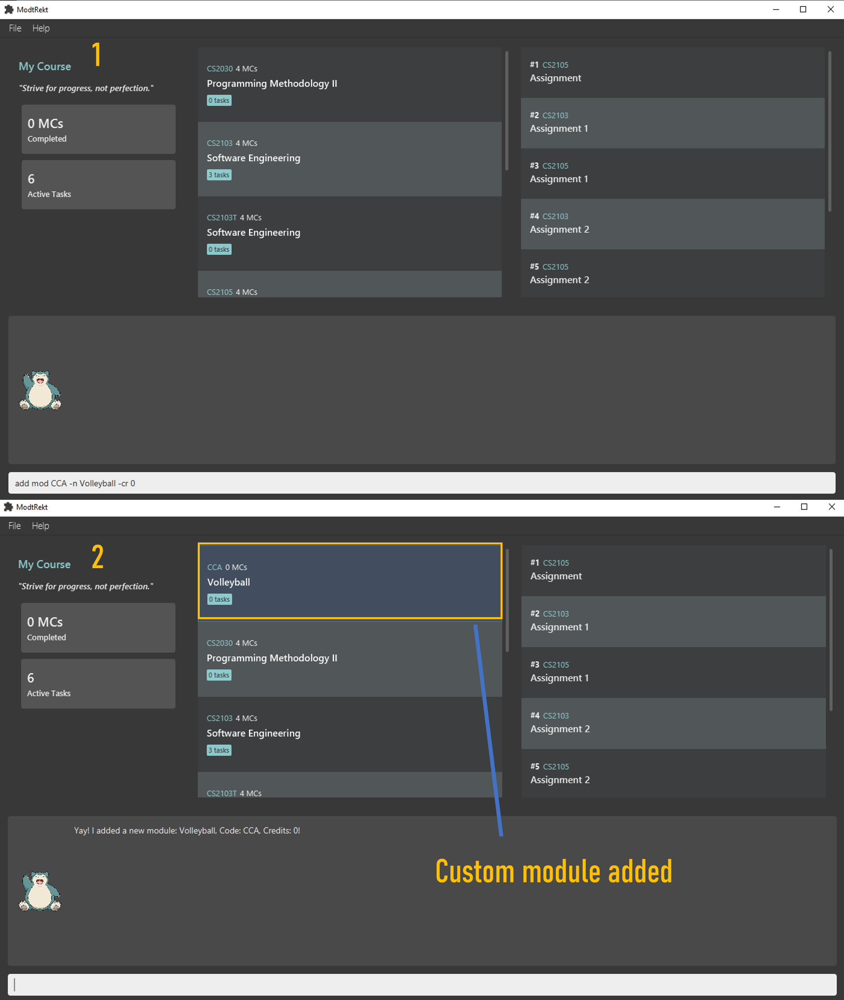

#### Removing a module: `remove module`

Deletes a module from the program. You have to specify a module code to delete.

Format: `remove module <module code>`

Shorthand: `rm module <module code>`, `rm mod <module code>`

- Module code must match an existing module.

Format: `remove module <module code>`

Shorthand: `rm module <module code>`, `rm mod <module code>`

Examples:
- `remove module CS2103T`
- `rm mod CS2103T`

Sample execution of command `remove mod CS2100`:
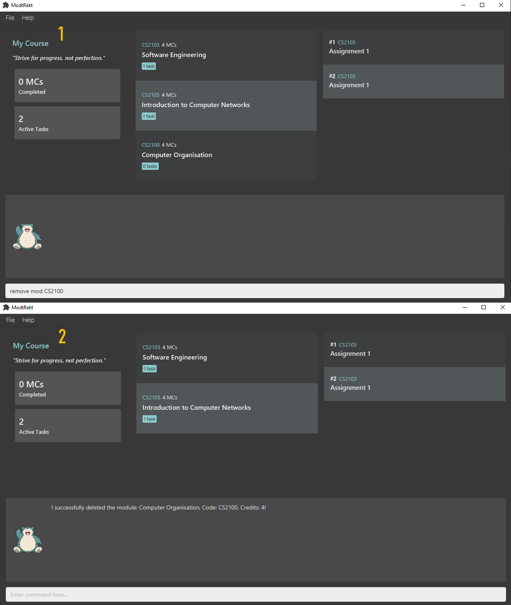

#### Entering a module: `cd`

Sets the current module page to the specified module.

Format: `cd <module code>`

Allows you to view information relating to the specified module.
- Scopes your actions to the specified module.
- Module code must match an existing module.

Format: `cd <module code>`

Examples:
- `cd CS2103T`

Sample execution of command `cd CS2100`:
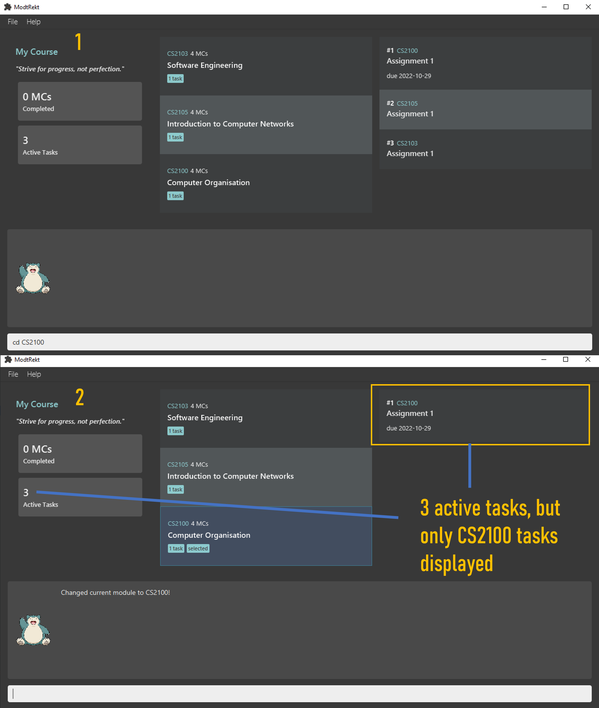

#### Exiting a module: `cd`

Exits the current module page to revert to showing all modules.

Format: `cd ..`

Allows you to view all active tasks from all modules instead of only those belonging to a specific module.

Examples:
- `cd ..`

Sample execution of command `cd ..`:
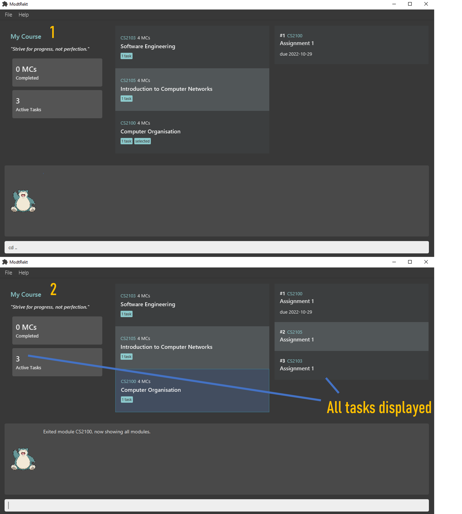

#### Marks a module as done: `done module`

Marks a module as done.

- After you mark a module as done, your total completed module credits (MCs) will be updated.
- Marking a module as done will mark all active tasks belonging to that module as done.
- You cannot execute this command while cd'd into any module.

>:warning: If there are `undone` tasks of a `done` module, you will be able to mark the module as done again, and the
`undone` task will be marked as `done`. 

Format: `done module <module code>`

Shorthand: `done mod <module code>`

Examples:
- `done module CS1101S`

Sample execution of command `done module CS2100`:
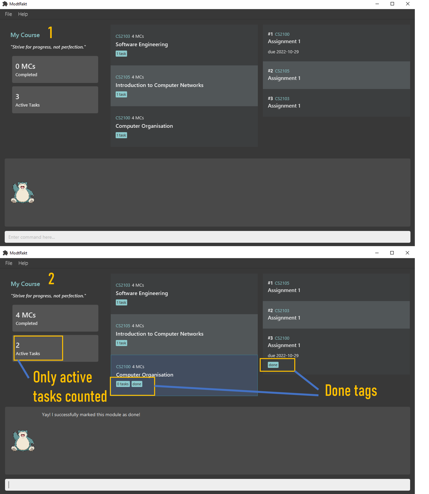

#### Marks undone a module: `undone module`

Marks a module as undone.

- After you unmark a module as done, your total completed module credits (MCs) will be updated.
- Unmarking a module will not affect its tasks, i.e. your original tasks will not be marked as undone)
- You cannot execute this command while cd'd into any module.

Format: `undone module <module code>`

Shorthand: `undone mod <module code>`

Examples:
- `undone module CS1101S`

Sample execution of command `done module CS2105`, with CS2105 marked as done initially:
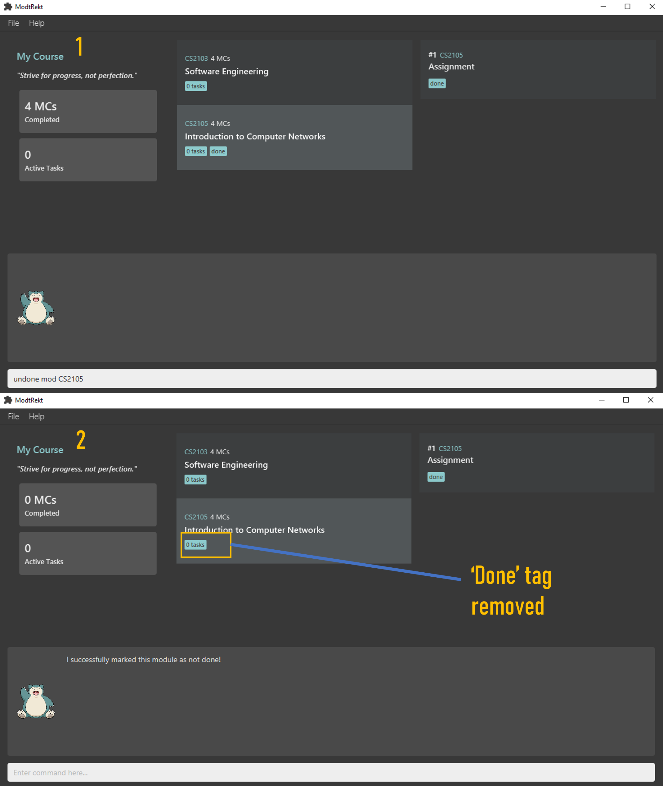

#### Listing all modules: `list module`

Shows all the modules you have added.
- Using the command without `-a` flag will show you only undone modules.
- Using the command with `-a` flag will show you all modules, including those marked as done.

Format: `list module [-a]`

Shorthand: `list mod [-a]`, `ls module [-a]`, `ls mod [-a]`

Examples:
- `list module -a`

Sample execution of command `list module -a`:
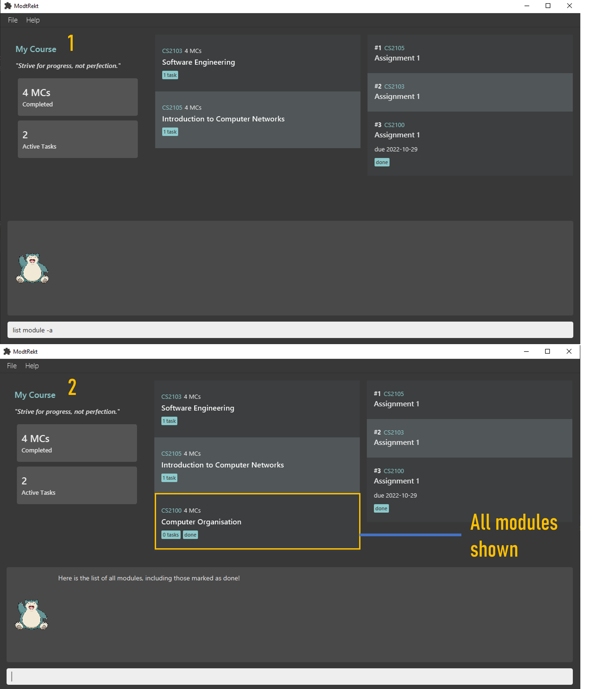

#### Editing modules: `edit module`

Changes current parameters of selected module.

- Targeted module code must exist in the module list
- New module code must not already exist in the module list
- All tasks associated with the module would change to the new module code after editing the module
- The order of optional tags does not matter

> Any edits to the module would not be checked against NUSMods again and is **taken as a customised module**.
> This means that a non-existent module e.g. `CS1111` would be accepted so long as it fulfils the parameter constraints.

Format: `edit module <module code> [-c <module code>] [-cr <module credit>] [-n <module name>]`

Examples:
- `edit module ST2334 -c CS2040S -cr 4 -n "Data Structures and Algorithms"`

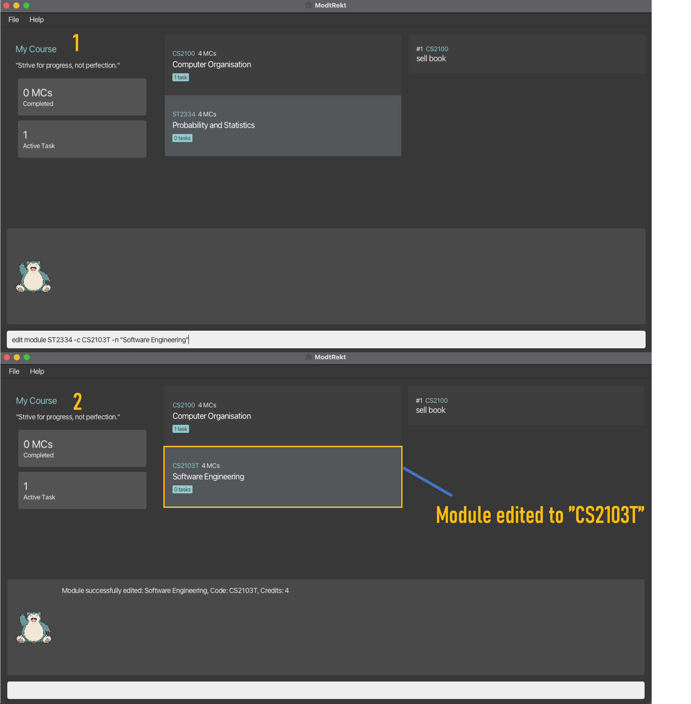

### Tasks

#### Adding a task: `add task`

Adds a task under a specific module.

- You may have selected a module (i.e. used the [`cd` command](#entering-a-module-cd) to select a module).
- You can specify a deadline for the task with the `-d` flag along with the deadline in YYYY-MM-DD format.
- The task description accepts only letters, numbers, spaces, and other
  American Standard Code for Information Interchange [(ASCII)](https://en.wikipedia.org/wiki/ASCII) characters.
- The task description must be enclosed in double-quotes (`""`) if it contains spaces.
- The symbols `-` and `"` are special characters and must be escaped with a backslash (`\`) to
  be used in the task description, e.g. `add task "foo\-\"bar\""` will result in the description `foo-"bar"`.
- The priority rating can be either "high", "medium", "low", or "none".

Format (if `cd`'d previously): `add task <description> [-d <deadline>] [-p <priority>]`

Format (if not `cd`'d): `add task <description> -c <module code> [-d <deadline>] [-p <priority>]`

Examples (CD'd into a module):
- `add task "do ip tasks" -d 2022-09-15`
- `add task -d 2022-09-15 "do ip tasks"`

Examples (Not CD'd into a module):
- `add task -c CS2103T "do ip tasks" -d 2022-09-15`
- `add task -d 2022-09-15 "do ip tasks" -c CS2103T`

Sample execution of command `add "Assignment 1" -c CS2100 -d 2022-10-29`:
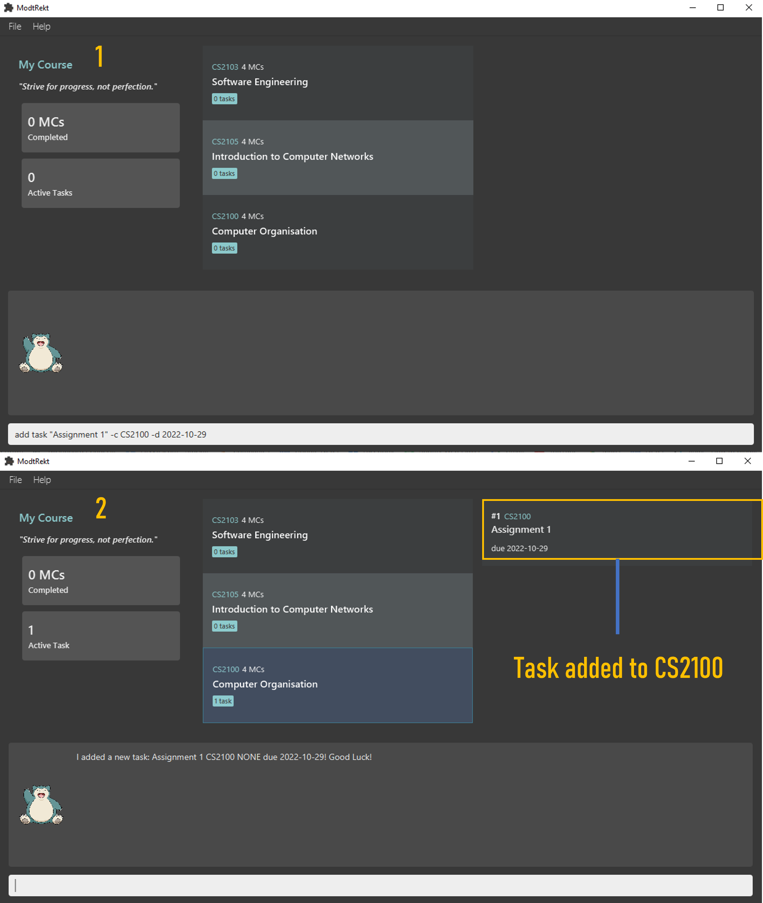

#### Removing a task: `remove task`

Removes a task under a specific module.

- The task index must be a non-zero positive integer, and have a corresponding task indicated with `#` in the task list.

Format: `remove task <task index>`

Shorthand: `rm task <task index>`

Examples:
- `remove task 1`
- `rm task 1`

Sample execution of command `remove task 1` with 2 active tasks displayed:
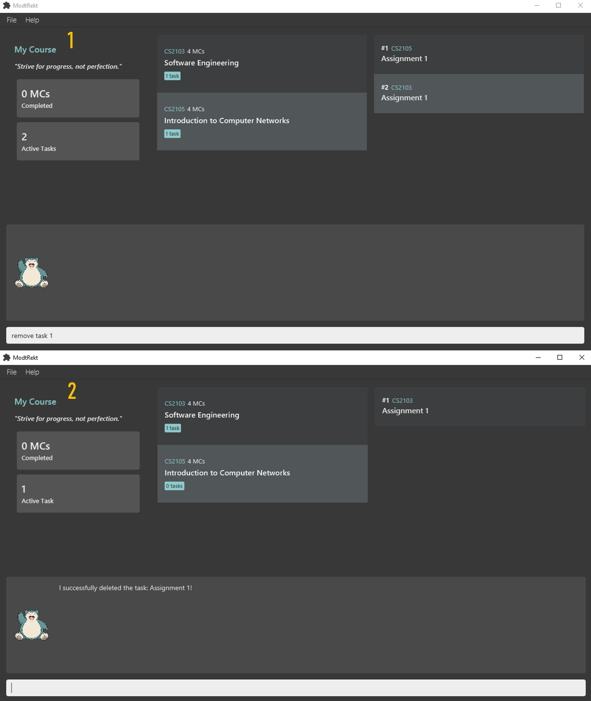

#### Marking a task as done: `done task`

Marks a task as done, specified via its index in the task list.

- The task index must be a non-zero positive integer, and have a corresponding task indicated with `#` in the task list.

Format: `done task <task index>`

Examples:
- `done task 1`

Sample execution of command `done task 1` with 6 active tasks displayed:
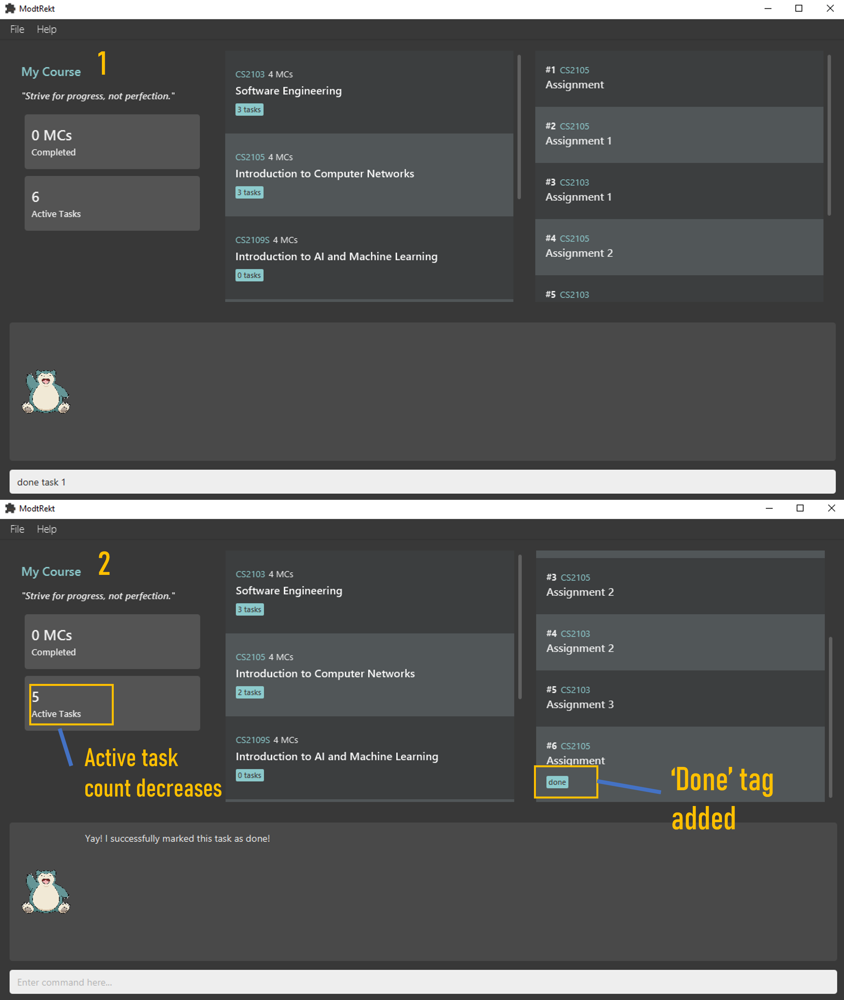

#### Marking a task as undone: `undone task`

Marks a task as undone, specified via its index in the task list.

- The task index must be a non-zero positive integer, and have a corresponding task indicated with `#` in the task list.

Format: `undone task <task index>`

Examples:
- `undone task 1`

Sample execution of command `undone task 6` with 6 active tasks displayed:
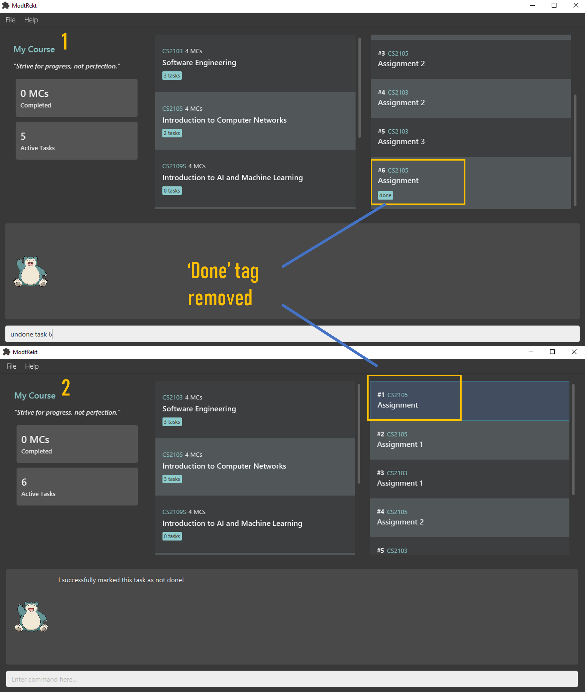

#### Listing all tasks: `list task`

Shows only the active tasks (i.e. tasks which are undone) by default.

- Include the optional `-a` flag to the command to show all tasks, including those that are done.
- If you have used the [`cd` command](#entering-a-module-cd) to select a module, this will
  only show the tasks under the selected module.
- Tasks are automatically sorted, in order, according to the following criteria:
  1) Done status
  2) Priority level
  3) Deadline
  4) Alphabetical order of description

>The sorting criteria is applied in order. For instance, a task that is undone will *always* appear before a task that is done, regardless of priority level, deadline or alphabetical order.
> 
>If two tasks are tied on the same criteria (e.g. both tasks have the same priority level), they will be tiebroken based on the next criteria.
> 
> For deadlines, tasks *without* associated deadlines are always displayed after tasks with associated deadlines.

Format: `list task [-a]`

Shorthand: `ls task [-a]`

Examples:
- `list task -a` shows all tasks, including those marked as done.
- `ls task` hides all done tasks.

#### Editing tasks: `edit task`

Changes current parameters of selected task

- Order of optional parameters does not matter.
- The new module code associated with task must exist in module list
- Task count in module would change accordingly after editing a task to be associated with another module

- You can add priorities into their tasks which will be ordered by decreasing priority in the task list
- 4 levels of priority: `NONE`, `LOW`, `MEDIUM`, `HIGH`
- can be set by adding: `-p none`, `-p low`, `-p medium`, `-p high` tags

Format: `edit task <task index> [-c <module code>] [-d <deadline>] [-ds <description>] [-p <priority>]`

Examples:
- `edit task 1 -d 2000-12-11 -ds "finish tutorial 9" -p high`
- `edit task 3 -p low -ds "finals exams" -c CS2103T`

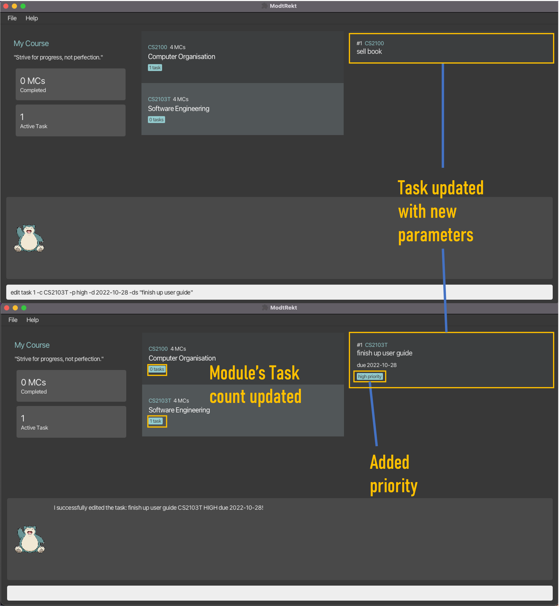

## FAQ

**Q**: How do I transfer my data to another Computer? 
**A**: Install the app in the other computer and overwrite the empty data file it creates with the file that contains
the data of your previous ModuleList home folder.

**Q**: Is my data saved when I close the app? 
**A**: Yes! We keep track of your modules and tasks, and they will automatically be shown when you re-open the application.

**Q**: Do I need a working internet connection to use this application? 
**A**: No, it is not required. We have a backup data file of all NUS modules for AY2022-2023, so no internet is required.

## Command Summary

### General

| Action            | Format          | Examples        |
|-------------------|-----------------|-----------------|
| **Help**          | `help`          | `help`          |
| **Exit**          | `exit`          | `exit`          |

### Modules

| Action                      | Format                                                                                                                                                       | Examples                                                           |
|-----------------------------|--------------------------------------------------------------------------------------------------------------------------------------------------------------|--------------------------------------------------------------------|
| **Add a module**            | `add module <mod code> [-n <mod name>] [-cr <mod credits>]`  `add mod <mod code> [-c <mod code>] [-cr <mod credits>]`                                    | `add module CS2103T` `add mod CS2103T`                         |
| **Remove a module**         | `remove module <mod code>` `remove mod <mod code>`  `rm module <mod code>` `rm mod <mod code>`                                                   | `remove module CS2103T` `rm mod cS2103t`                       |
| **Edit a module**           | `edit module <mod code> [-c <mod code>] [-n <mod name>] [-cr <mod credits>]`   `edit mod <mod code> [-c <mod code>] [-n <mod name>] [-cr <mod credits>]` | `remove module CS2103T` `rm mod cS2103t`                       |
| **Select a module**         | `cd <mod code>`                                                                                                                                              | `cd CS2103T`                                                       |
| **Deselect modules**        | `cd ..`                                                                                                                                                      | `cd ..`                                                            |
| **Mark a module as done**   | `done module <mod code>`   `done mod <mod code>`                                                                                                         | `done module CS1101S`   `done mod CS1101S`                     |
| **Mark a module as undone** | `undone module <mod code>`   `undone mod <mod code>`                                                                                                     | `undone module CS1101S`   `undone mod CS1101S`                 |
| **List modules**            | `list module [-a]`   `list mod [-a]`   `ls module [-a]`   `ls mod [-a]`                                                                          | `list module`  `list mod -a`  `ls module`  `ls mod -a` |

### Tasks

| Action                    | Format                                                                                  | Examples                                             |
|---------------------------|-----------------------------------------------------------------------------------------|------------------------------------------------------|
| **Add a task**            | `add task <description> -c <module code> [-d <deadline>] [-p <priority>]`               | `add task "tP v1.3" -d 2022-10-28 -c CS2100 -p high` |
| **Remove a task**         | `remove task <index> ` `rm task <index>`                                            | `remove task 1` `rm task 1`                      |
| **Edit a task**           | `edit task <index> [-c <mod code>] [-d <deadline>] [-ds <description>] [-p <priority>]` | `edit task 1 -p low`                                 |
| **Mark a task as done**   | `done task <index>`                                                                     | `done task 1`                                        |
| **Mark a task as undone** | `undone task <index>`                                                                   | `undone task 1`                                      |
| **List tasks**            | `list task [-a]`   `ls task [-a]`                                                   | `list task` `ls task -a`                         |

## Glossary

|             Terms | Description                                                                                             |
|------------------:|---------------------------------------------------------------------------------------------------------|
|            **AY** | Academic Year                                                                                           |
|           **GUI** | Graphical User Interface                                                                                |
|           **CLI** | Command Line Interface                                                                                  |
|        **Syntax** | Structure of statements                                                                                 |
|       **NUSMods** | A timetabling application created for NUS students, containing information about all modules in NUS.    |
|            **cd** | Shorthand for `change directory`, in the context of our application, modules can be seen as directories |
|           **MCs** | Modular credits                                                                                         |
|         **ASCII** | American Standard Code for Information Interchange                                                      |
|           **NUS** | National University of Singapore                                                                        |
